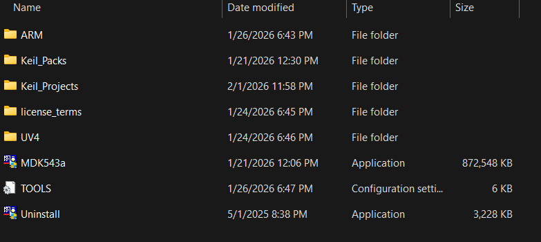
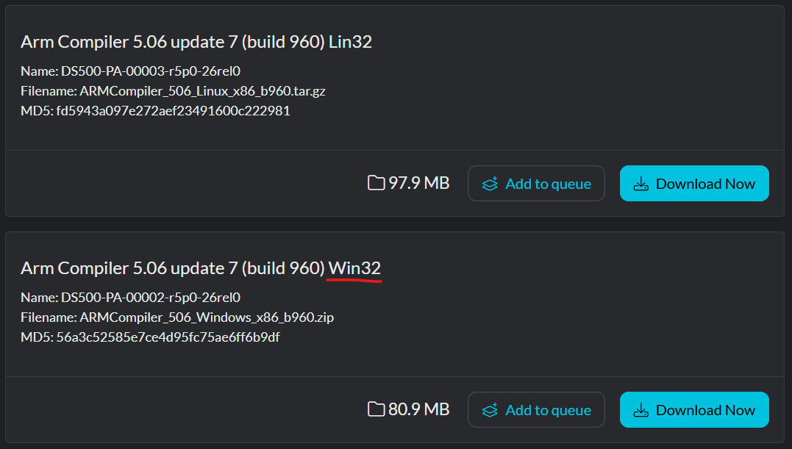

# ECE 644

## Install & set up Keil v5
- Always install Keil in your OS main dir (C:) or you might have problems with the pack installer not working correctly. Here's how I set up my folder (C:/Keil_v5): 

- You'll have to make **Keil_Packs** and **Keil_Projects** folders yourself. **Install Keil directly inside Keil_v5/**

## Process
- place the installer inside your Keil_v5 folder and run it.
- choose Keil_v5 as the base installation folder and Keil_Packs for the ARM pack folder. That should be all you need to do to install Keil.
- Open the Pack Installer. It should open automatically when you start Keil for the first time. Select the MK22fsomething in devices, then download the (list of packs here) on the right side of the program window.

## Tricks
- You need the ARM v5 compiler on your computer in order to build your project. If your Keil installation somehow doesn't include it (it didn't for me), you'll have to install it manually. Look for 
 
- Get it [here.](https://developer.arm.com/downloads/view/ACOMP5?sortBy=availableBy&revision=r5p6-07rel1) (btw you'll need to make an ARM account to access the download. It's annoying.)
- install the compiler in a folder called ARMCC inside Keil_v5/ARM/
- (provide instructions on how to tell Keil to use the compiler)